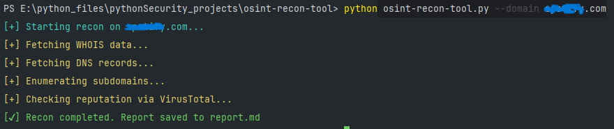

Here is the complete README.md content in one clean block — ready to copy-paste:

- # OSINT Recon Tool
- Simple, fast, terminal-based OSINT reconnaissance script for domains
- Collects WHOIS, DNS records, live subdomains + VirusTotal reputation
- Everything saved automatically into a nicely formatted `report.md`

- ## Features
- WHOIS information (registrar, dates, nameservers, country…)
- Common DNS records → A, MX, TXT, NS
- Multithreaded subdomain enumeration (using your wordlist)
- VirusTotal reputation check (detection stats + per-engine results)
- Colored terminal progress messages (won’t pollute the report)
- Clean markdown report with emoji sections

- ## Requirements
- Python 3.8+
- Packages:
  - whois
  - dnspython
  - colorama
  - requests
- (optional but strongly recommended) → subdomains_wordlist.txt

- ## Installation / Setup
- Clone / download the script
- Install dependencies:
  - pip install whois dnspython colorama requests
- Create `config.py` in the same folder:
  - VIRUSTOTAL_API_KEY = "vt_key_goes_here"
- (optional) Put a subdomain wordlist named `subdomains_wordlist.txt` in the same folder
  - Popular small ones: SecLists top 5000, dnscan 5000, etc.

- ## Usage
- python recon.py -d example.com
- python recon.py --domain tesla.com
- python recon.py -d target.com

- ## What you get
- Colored progress messages in terminal (stderr)
- Full report saved as `report.md` in the current directory
- Example report structure:
  - # 🧠 Recon Report for `target.com`
  - ## 🌐 WHOIS Information
  - ## 📡 DNS Records
  - ## 🔎 Subdomain Enumeration
  - ## 🛡️ Reputation Analysis

- ## Terminal Output

- ## Important Notes
- VirusTotal free API → ~4–5 requests per minute (be patient)
- Subdomain enumeration is noisy → start with small wordlist (500–5000 entries)
- Many domains now use WHOIS privacy → expect redacted registrant info
- High `max_workers` (30) + big wordlist = high DNS traffic → can look suspicious

- ## Legal / Ethical Reminder
- Only use on domains you own or have explicit written permission to recon
- Unauthorized scanning can violate laws (CFAA, Computer Misuse Act, etc.)
- This tool is for educational / authorized security testing only

 ## Made with ☕ by Nimesh Nilashan

 
### Happy (and legal) hunting 🚀

